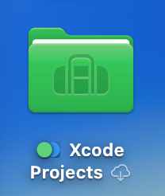
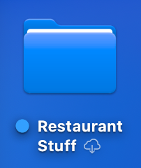

### This is page 1
<!-- 
Note in the following, I use the ../ to go up one directory level
to access the Resources folder.
-->
#### This is an image from Resources:

#### Two images from Resources on same line:
 
#### Using image to link back to home page:
<!-- 
Note in the following, if I use index.md, the browser displays
the markdown file as plain text. If I use index.html, the browser
renders the page correctly. Use this technique to create a
clickable image link back to the home page.
-->

#### Attempting to scale the green image:
{:height="150px" width="150px"}

<!-- 
Note in the following, I am attempting to break a long line
of text into multiple lines in my editor for readability.
The first two lines I copied and pasted from a reference.
At the end of the second line, I used a fn-return keystroke,
then typed the third line manually.
-->
This very long line of text will be broken into multiple lines in my editor for readability.
This is the second line in my editor, but the rendered output will ignore the line break.
And this is the third line, created after typing fn-return 

Here is another line of text that I would like to appear as green >

Here is a line of text that should appear in red font {: style="color:#c70039;"}

#### Return to opening page (home):
[home](../index.)